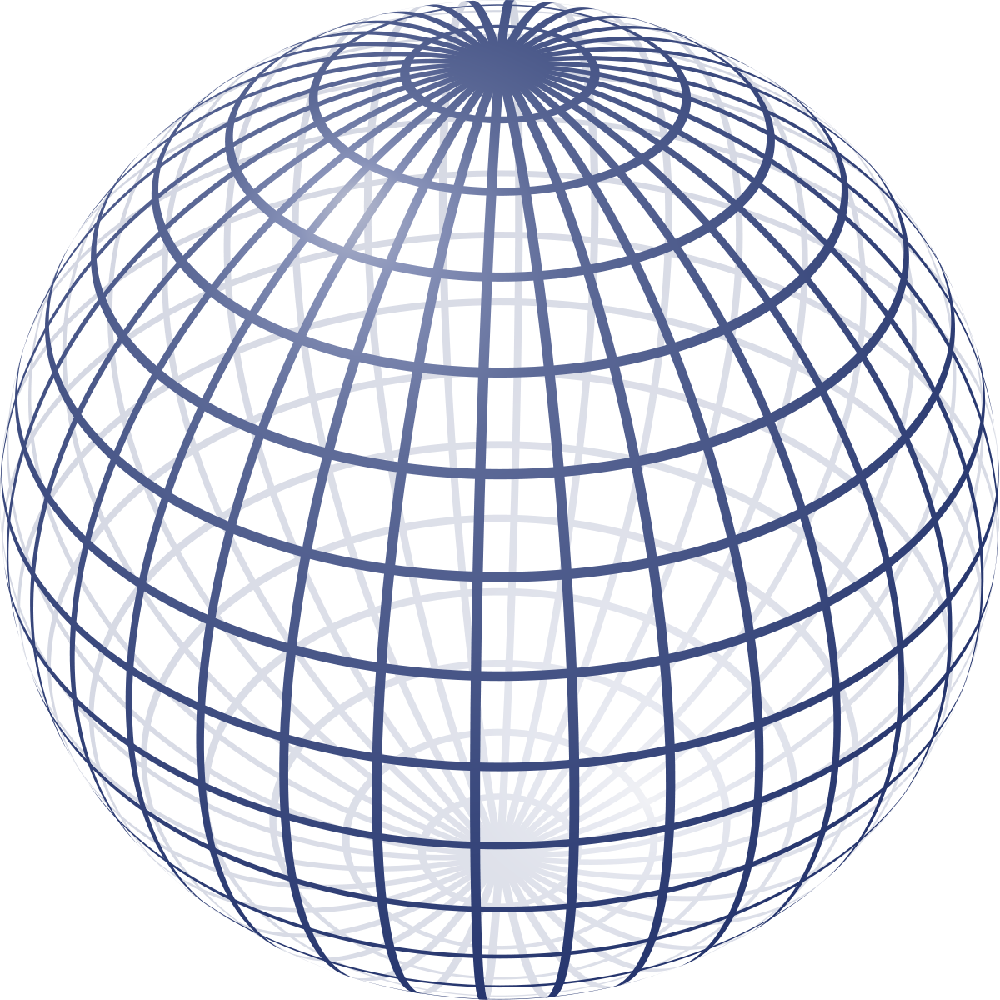
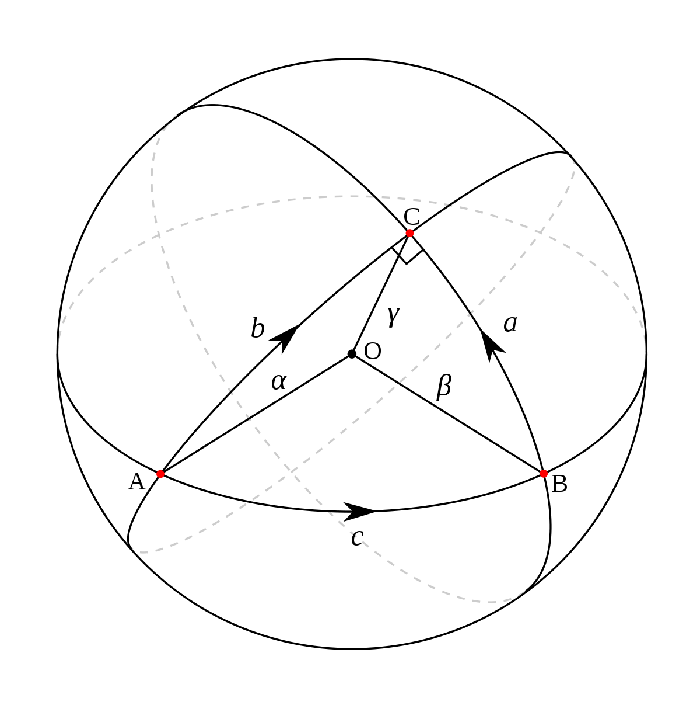
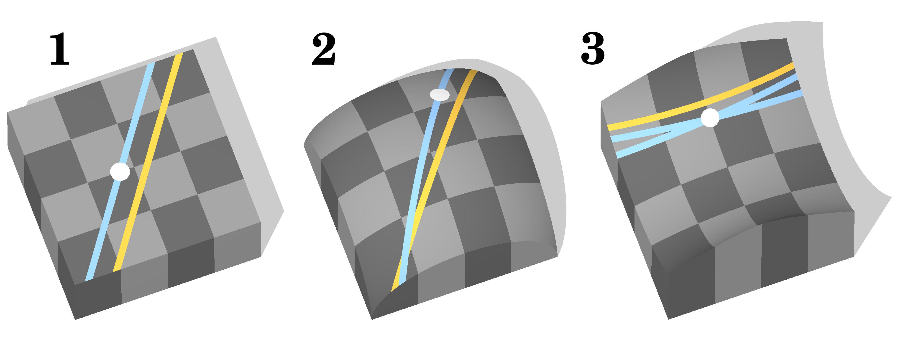
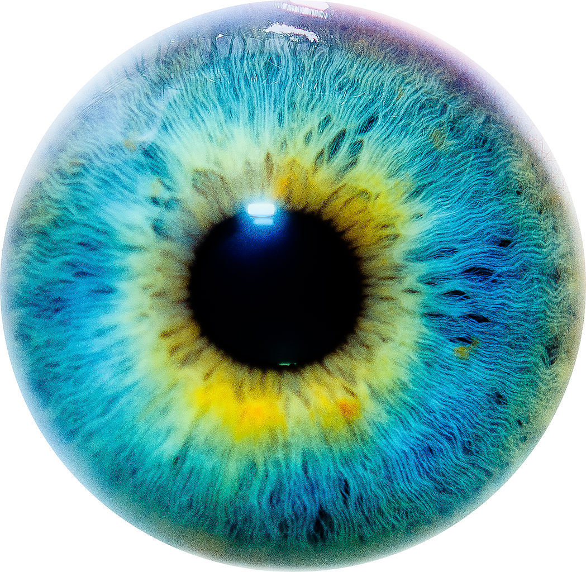
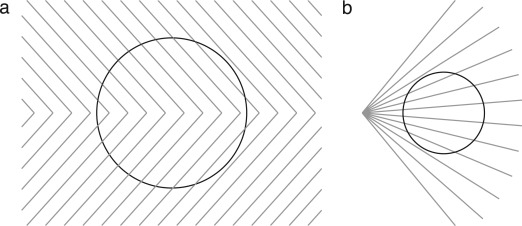

<section id="themes">
	<h2>Themes</h2>
		

			Set your presentation theme:  
			<!-- Hacks to swap themes after the page has loaded. Not flexible and only intended for the reveal.js demo deck. -->
                        <a href="#" onclick="document.getElementById('theme').setAttribute('href','css/theme/black.css'); return false;">Black (default)</a> -
			<a href="#" onclick="document.getElementById('theme').setAttribute('href','css/theme/white.css'); return false;">White</a> -
			<a href="#" onclick="document.getElementById('theme').setAttribute('href','css/theme/league.css'); return false;">League</a> -
			<a href="#" onclick="document.getElementById('theme').setAttribute('href','css/theme/sky.css'); return false;">Sky</a> -
			<a href="#" onclick="document.getElementById('theme').setAttribute('href','css/theme/beige.css'); return false;">Beige</a> -
			<a href="#" onclick="document.getElementById('theme').setAttribute('href','css/theme/simple.css'); return false;">Simple</a>  
			<a href="#" onclick="document.getElementById('theme').setAttribute('href','css/theme/serif.css'); return false;">Serif</a> -
			<a href="#" onclick="document.getElementById('theme').setAttribute('href','css/theme/blood.css'); return false;">Blood</a> -
			<a href="#" onclick="document.getElementById('theme').setAttribute('href','css/theme/night.css'); return false;">Night</a> -
			<a href="#" onclick="document.getElementById('theme').setAttribute('href','css/theme/moon.css'); return false;">Moon</a> -
			<a href="#" onclick="document.getElementById('theme').setAttribute('href','css/theme/solarized.css'); return false;">Solarized</a>
		

</section>

H:

# Beyond Turing Computing

Ciro Iván García López

H:

# Contents

 1. Introduction<!-- .element: class="fragment" data-fragment-index="1"-->
 2. Classic Models of Computation<!-- .element: class="fragment" data-fragment-index="1"-->
 3. Equivalence Between Models<!-- .element: class="fragment" data-fragment-index="1"-->
 4. Turing on the Edge<!-- .element: class="fragment" data-fragment-index="1"-->
 5. Beyond Turing Computing<!-- .element: class="fragment" data-fragment-index="1"-->

     
     
H:

## Introduction

The study of computability has its origin in Hilbert's conference of 1900, where an adjacent question, to the ones he asked, is to give a precise description of the notion of algorithm. 

V:

In the search for a good definition arose three independent theories: 

1. Turing and the Turing machines.
2. Gödel and the recursive functions.
3. Church and the Lambda Calculus. 

H:

## Riemmanian Geometry

* The Sphere Geometry 

<figure>
    
</figure>

V:

## Fundamentals 

* There are no parallel lines to a given line.

<figure>
    
</figure>

V:

## Types of Geometry

<figure>
    
</figure>

H:

## Why Riemmanian Geometry ?

* Is the Euclidean geometry the correct for the eye ?
<figure>
    
</figure>

V: 
## Heiring's Illusions - Variation

<figure>
    
    <figcaption> Taken from [2] <figcaption/>
</figure>

V:
## Ideas from the articles. 

 | Context Perturbation | Optimization |
 |---------------|-------|
 | “We conceive of the deformations of the target as resulting from a context-induced perturbation of that ‘‘base’’ geometry.”  |  “We propose to model the perceptual distortion of the target as the solution to a minimization problem in the calculus of variations."[geodesics]     |

V:

## And now ...  

* “Our geometric paradigm may be reminiscent of studies of the metric properties of visual space, a topic at times intensely debated In the vision research.”

* “Some of these limitations follow naturally from our decision for a ‘‘phenomenological’’, i.e.purely descriptive theory of the GOI phenomena(Wackermann, 2010), disregarding possibly underlying neuro physiological or neuro psychological mechanism.”

H: 
     
## References

* [1] [ Ehm, W., & Wackermann, J. (2016). Geometric–optical illusions and Riemannian geometry. Journal Of Mathematical Psychology, 7128-38. doi:10.1016/j.jmp.2016.01.005 ]( http://www.sciencedirect.com/science/article/pii/S0022249616000079 ).

* [2] [ Ehm, W., & Wackermann, J. (2012). Modeling geometric–optical illusions: A variational approach. Journal Of Mathematical Psychology, 56404-416. doi:10.1016/j.jmp.2012.12.001  ]( http://www.sciencedirect.com/science/article/pii/S002224961200123X  )

* Mathematical Visualization [Charles Gunn](http://page.math.tu-berlin.de/~gunn/)

* Images taken from [Wikimedia](https://commons.wikimedia.org/wiki/)

* [ Lovecraft Science ](https://lovecraftianscience.wordpress.com/2014/01/23/lovecraft-and-mathematics-non-euclidean-geometry/)

* [Non Euclidean Gallery ](http://www.deviantart.com/tag/noneuclidean?offset=14)

