<section id="themes">
	<h2>Themes</h2>
		

			Set your presentation theme:  
			<!-- Hacks to swap themes after the page has loaded. Not flexible and only intended for the reveal.js demo deck. -->
                        <a href="#" onclick="document.getElementById('theme').setAttribute('href','css/theme/black.css'); return false;">Black (default)</a> -
			<a href="#" onclick="document.getElementById('theme').setAttribute('href','css/theme/white.css'); return false;">White</a> -
			<a href="#" onclick="document.getElementById('theme').setAttribute('href','css/theme/league.css'); return false;">League</a> -
			<a href="#" onclick="document.getElementById('theme').setAttribute('href','css/theme/sky.css'); return false;">Sky</a> -
			<a href="#" onclick="document.getElementById('theme').setAttribute('href','css/theme/beige.css'); return false;">Beige</a> -
			<a href="#" onclick="document.getElementById('theme').setAttribute('href','css/theme/simple.css'); return false;">Simple</a>  
			<a href="#" onclick="document.getElementById('theme').setAttribute('href','css/theme/serif.css'); return false;">Serif</a> -
			<a href="#" onclick="document.getElementById('theme').setAttribute('href','css/theme/blood.css'); return false;">Blood</a> -
			<a href="#" onclick="document.getElementById('theme').setAttribute('href','css/theme/night.css'); return false;">Night</a> -
			<a href="#" onclick="document.getElementById('theme').setAttribute('href','css/theme/moon.css'); return false;">Moon</a> -
			<a href="#" onclick="document.getElementById('theme').setAttribute('href','css/theme/solarized.css'); return false;">Solarized</a>
		

</section>

H:

# Colors

Jean Pierre Charalambos

H:

# Index

 1. Color Vision Intro<!-- .element: class="fragment" data-fragment-index="1"-->
     1. Spectral colors and spectral sensitivity
     2. Human eye
     3. Effects
 2. Color Models Intro<!-- .element: class="fragment" data-fragment-index="2"-->
     1. Additive coloring
     1. Subtracting coloring
 3. Color Models<!-- .element: class="fragment" data-fragment-index="3"-->
     1. Additive coloring (RGB)
     1. Subtracting coloring (RYB, CMY(K))
     1. ~additive / ~subtractive (HSV & HSL, CIE 1931 XYZ)
     
H:

## Color Vision Intro

 1. Spectral colors <!-- .element: class="fragment" data-fragment-index="1"-->
 2. Human eye <!-- .element: class="fragment" data-fragment-index="2"-->
 3. Spectral sensitivity <!-- .element: class="fragment" data-fragment-index="3"-->
 4. Normal effects <!-- .element: class="fragment" data-fragment-index="4"-->
 5. Anomalies <!-- .element: class="fragment" data-fragment-index="5"-->
 6. Vision table <!-- .element: class="fragment" data-fragment-index="6"-->

V:

## Color vision: Spectral Colors
## Visible spectral colors

<figure>
    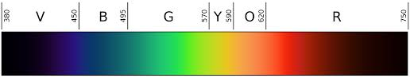
    <figcaption>Visible spectrum (in terms of wavelength)</figcaption>
</figure>

N:
Mirror -> in terms of frequency (observe infra-red and ultraviolet)
 * Violet -> ultraviolet -> X rays
 * Infrared -> microwaves -> FM radio & TV -> AM radio

V:

## Color Vision: Spectral Colors

<figure>
    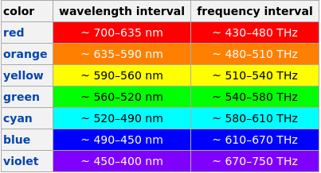
    <figcaption>Visible light spectrum colors</figcaption>
</figure>

V:

## Color Vision: Human Eye

<figure>
    
    <figcaption>Camera Obscura</figcaption>
</figure>

V:

## Color Vision: Human Eye

<figure>
    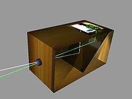
    <figcaption>Camera Obscura</figcaption>
</figure>

V:

## Color Vision: Human Eye

<figure>
    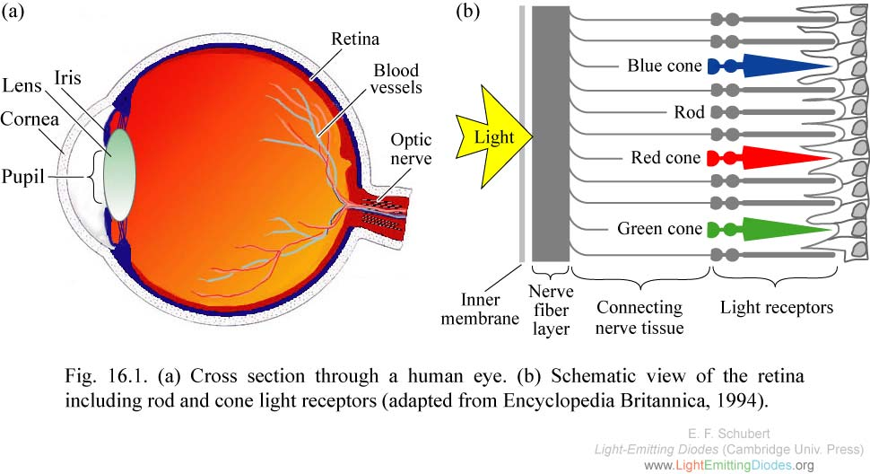
    <figcaption>Human Eye</figcaption>
</figure>

N:
* Rod: scotopic vision
* Cones: color vision

V:

## Color Vision: Spectral Sensitivity

<figure>
    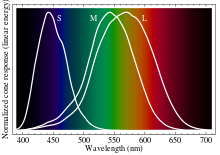
    <figcaption>Normalized responsivity spectra of human cone (trichromatic) cells: S, M, L</figcaption>
</figure>

N:
* Spectral sensitivity: is the relative efficiency of detection (medium), of light or other signal, as a function of the frequency or wavelength of the signal.
* Medium: Eye cones, (film) película fotografica

V:

## Color Vision: Spectral sensitivity

<figure>
    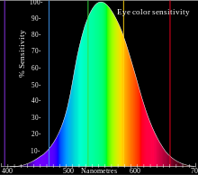
    <figcaption>Eye sensitivity</figcaption>
</figure>

V:

## Color Vision: Normal effects
### Affterimages

<figure>
    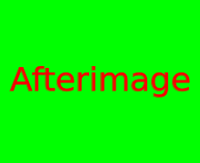
    <figcaption>Negative afterimage</figcaption>
</figure>

N:

* If the viewer stares at this image for 20–60 seconds and then looks at a white object, a negative afterimage will appear

V:

## Color Vision: Normal effects
### Motion after-effects

<section>
	<iframe data-autoplay width="420" height="345" src="http://www.youtube.com/embed/GhyEIAfyXx8"></iframe>
</section>

V:

## Color Vision: Anomalies
### Tetrachromacy

<figure>
    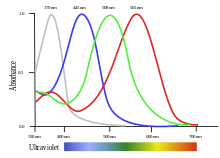
    <figcaption>The four pigments in the [Estrildid finch](http://en.wikipedia.org/wiki/Estrildid_finch) bird's cones</figcaption>
</figure>

N:

* extended color vision into the ultraviolet
* present in some birds, fish, amphibians, reptiles and insects.
* was also the normal condition of most mammals in the past; a genetic change made the majority of species of this class eventually lose two of their four cones.

V:

## Color Vision: Anomalies
### Tetrachromacy

<figure>
    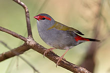
    <figcaption>Estrildid finch</figcaption>
</figure>

V:

## Color Vision: Anomalies
### Women's tetrachromacy

<figure>
    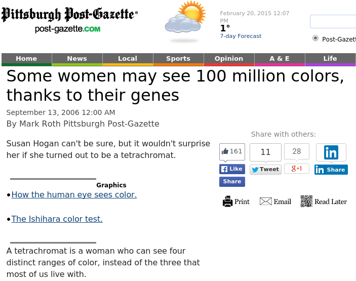
    <figcaption>[Women's tetrachromacy](http://www.post-gazette.com/news/health/2006/09/13/Some-women-may-see-100-million-colors-thanks-to-their-genes/stories/200609130255)</figcaption>
</figure>

V:

## Color Vision: Anomalies
### Dichromacy and achromacy

<figure>
    
    <figcaption>Isihara test: trichromats -> "74", dichromats -> "21", achromats -> null</figcaption>
</figure>

V:

## Color Vision: Anomalies
### Dichromacy and achromacy

<figure>
    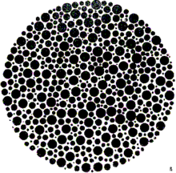
    <figcaption>Isihara test: 12 or null</figcaption>
</figure>

V:

## Color Vision: Vision table

| State         | Cones | Colors | Porters                              |
|---------------|-------|--------|--------------------------------------|
| Monochromacy  | 1     | 100    | marine mammals, achromat humans      |
| Dichromacy    | 2     | 10,000 | most terrestrial non-primate mammals |
| Trichromacy   | 3     | 1'     | most primates, some insects          |
| Tetrachromacy | 4     | 100'   | most rept., amph., birds & insects   |
| Pentachromacy | 5     | 10000' | some insects and birds               |

H:

## Color Models Intro

 * Definition<!-- .element: class="fragment" data-fragment-index="1"-->
     * Math model describing the way colors can be represented as tuples
     * Each tuple number -> primary color
     * Primary colors -> sets of colors that can be combined to make a useful range of colors
     * Secondary color -> mixes two or more primary colors in a given color space
 * Types<!-- .element: class="fragment" data-fragment-index="2"-->
     * Additive coloring
     * Subtracting coloring

V:

## Color Models Intro: Additive coloring

* Color -> Mixing of a limited set of colors lights
* Process to create a wide color range:
  1. Start with darkness
  2. Add light sources of various wavelengths
* Used in e.g., computer monitors and tvs
* Examples: RGB

V:

## Color Models Intro: Additive coloring

<figure>
    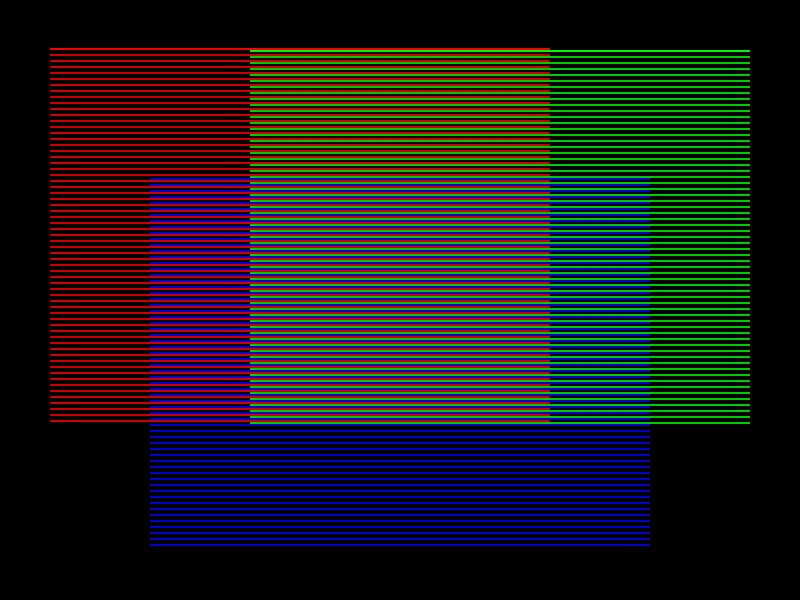
    <figcaption>Additive mixing of primary colors by proximity</figcaption>
</figure>

V:

## Color Models Intro: Subtractive coloring

* Color -> Mixing of a limited set of dyes, inks, paint pigments or natural colorants
* Process to create a wide color range:
  1. Start with (white) light
  2. Subtract wavelengths from the light: Add colored inks, paints, or filters between the viewer and the light source or reflective surface
* Used in e.g., color printers, analog photography
* Examples: RYB, CMY, CMYK

V:

## Color Models Intro: Subtractive coloring

<figure>
    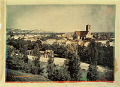
    <figcaption>Color photo, [Louis Ducos du Hauron](http://en.wikipedia.org/wiki/Louis_Arthur_Ducos_du_Hauron) (1877)</figcaption>
</figure>

H:

## Color Models

1. Additive  <!-- .element: class="fragment" data-fragment-index="1"-->
    1. RGB
1. Subtractive  <!-- .element: class="fragment" data-fragment-index="2"-->
    2. RYB
    3. CMY(K)
1. Non-additive non-subtractive  <!-- .element: class="fragment" data-fragment-index="3"-->
    1. HSV & HSL
    1. CIE 1931 XYZ

V:

## Color Models: RGB

<figure>
    
    <figcaption>RGB: primary and secondary colors</figcaption>
</figure>

V:

## Color Models: RGB
### Common representations

Normalized:

$$[r,g,b]=[0..1,0..1,0..1]$$

Ranged:

$$[r,g,b]=[0..255,0..255,0..255]$$

V:

## Color Models: RGB

<figure>
    
    <figcaption>The RGB (color model mapped to a) cube</figcaption>
</figure>

V:

## Color Models: RGB

<figure>
    
    <figcaption>RGB color-selector ui</figcaption>
</figure>

V:

## Color Models: RYB

<figure>
    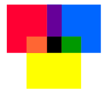
    <figcaption>RYB primary and secondary colors</figcaption>
</figure>

V:

## Color Models: RYB

<figure>
    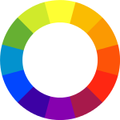
    <figcaption>RYB color wheel</figcaption>
</figure>

N:
Francisco de Miranda <-> Goethe meeting in Weimar 1785 :-> [colombian flag](http://en.wikipedia.org/wiki/Theory_of_Colours#Influence_on_Latin_American_flags)

V:

## Color Models: RYB

<section>
	<iframe data-autoplay width="420" height="345" src="http://www.youtube.com/embed/MmhSXTMTtJM"></iframe>
</section>
[Johann Wolfgang von Goethe](http://en.wikipedia.org/wiki/Johann_Wolfgang_von_Goethe). Theory of Colors (1810)

V:

## Color Models: CMY(K)

<figure>
    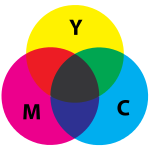
    <figcaption>CMY: primary and secondary colors</figcaption>
</figure>

V:

## Color Models: CMY(K)

<figure>
    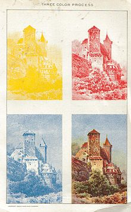
    <figcaption>CMY early representation</figcaption>
</figure>

V:

## Color Models: CMY(K)

<figure>
    
    <figcaption>The CMY (color model mapped to a) cube</figcaption>
</figure>

V:

## Color Models: CMY(K)
### Conversion from/to RGB

From RGB:

$$[c,m,y]=[1,1,1]-[r,g,b]$$

To RGB:
$$[r,g,b]=[1,1,1]-[c,m,y]$$

V:

## Color Models: HSV and HSL
### Motivation: Usability

<figure>
    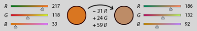
    <figcaption>RGB color selection</figcaption>
</figure>

V:

## Color Models: HSV and HSL

<figure>
    
    <figcaption>HSL (a–d) and HSV (e–h) models</figcaption>
</figure>

V:

## Color Models: HSV and HSL

<figure>
    
    <figcaption>HSV</figcaption>
</figure>

V:

## Color Models: HSV and HSL

<figure>
    
    <figcaption>HSL</figcaption>
</figure>

V:

## Color Models: HSV and HSL

<figure>
    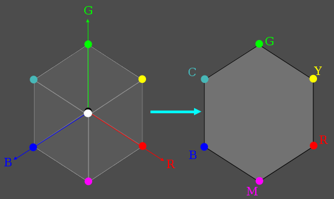
    <figcaption>HSV & HSL Geometric derivation</figcaption>
</figure>

V:

## Color Models: HSV and HSL

<figure>
    
</figure>

N:
[bug next slide note appear here]
Luma takes: gamma-corrected R, G, and B

V:

## Color Models: HSV and HSL

<figure>
    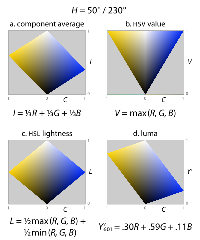
    <figcaption>HSV & HSL "lighthness"</figcaption>
</figure>

V:

## Color Models: HSV and HSL

<figure>
    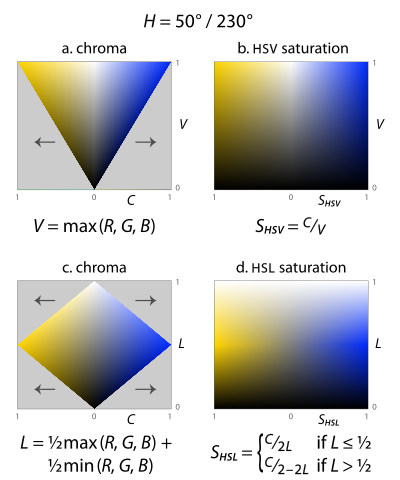
    <figcaption>HSV & HSL "saturation"</figcaption>
</figure>

V:

## Color Models: HSV and HSL

<figure>
    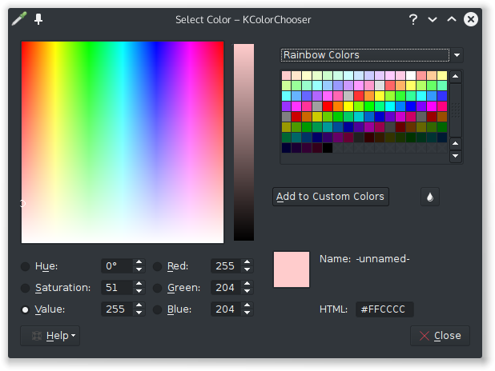
    <figcaption>KColorChooser</figcaption>
</figure>

V:

## Color Models: CIE 1931 XYZ

* International Commission on Illumination (CIE)
* CIE 1931 RGB + CIE 1931 XYZ
* Physical pure colors (wavelength) <-> physiological perceived colors in human color vision
* Translate different srcs into a universal human color vision response

V:

## Color Models: CIE 1931 XYZ

<figure>
    
    <figcaption>The CIE 1931 RGB Color matching functions</figcaption>
</figure>

V:

## Color Models: CIE 1931 XYZ

The CIE standard observer color matching functions

Z -> Blue stimulation, Y -> Luminance, X -> Mix of cone response curves chosen to be nonnegative

V:

## Color Models: CIE 1931 XYZ

$$x = \frac{X}{X+Y+Z}$$
$$y = \frac{Y}{X+Y+Z}$$
$$z = \frac{Z}{X+Y+Z} = 1 - x - y$$

CIE xyY color space: x, y (chromaticity), and Y (tristimulus)

V:

## Color Models: CIE 1931 XYZ

Observation: $X$ and $Z$ are $f(x,y,Y)$:
  $$X=\frac{Y}{y}x</math>$$
  $$Z=\frac{Y}{y}(1-x-y)$$

V:

## Color Models: CIE 1931 XYZ

<figure>
    
    <figcaption>The CIE 1931 color space chromaticity diagram</figcaption>
</figure>

V:

## Color Models: CIE 1931 XYZ

<figure>
    
    <figcaption>CIE RGB gamut on top of the xy diagram</figcaption>
</figure>

V:

## Color Models: CIE 1931 XYZ

Helps to determine:

* Complementary colors
* Dominant wavelength (hue)

H:

## References

* [Color](http://en.wikipedia.org/wiki/Color)
* [Color Vision](http://en.wikipedia.org/wiki/Color_vision)
* [Color Theory](http://en.wikipedia.org/wiki/Color_theory)
* [Some women may see 100 million colors, thanks to their genes](http://www.post-gazette.com/news/health/2006/09/13/Some-women-may-see-100-million-colors-thanks-to-their-genes/stories/200609130255)
* [RGB color model](http://en.wikipedia.org/wiki/RGB_color_model)
* [RYB Color model](http://en.wikipedia.org/wiki/RYB_color_model)
* [Theory of Colours. Goethe](https://theoryofcolor.org/Theory+of+Colours)
* [CMY(K)](http://en.wikipedia.org/wiki/CMYK_color_model)
* [HSV & HSL color models](http://en.wikipedia.org/wiki/HSL_and_HSV)
* [CIE 1931 XYZ](http://en.wikipedia.org/wiki/CIE_1931_color_space)
* [Solarized](http://ethanschoonover.com/solarized)
